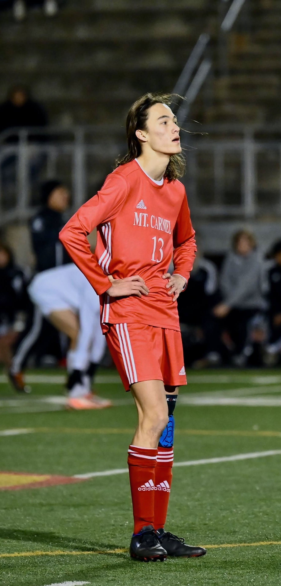
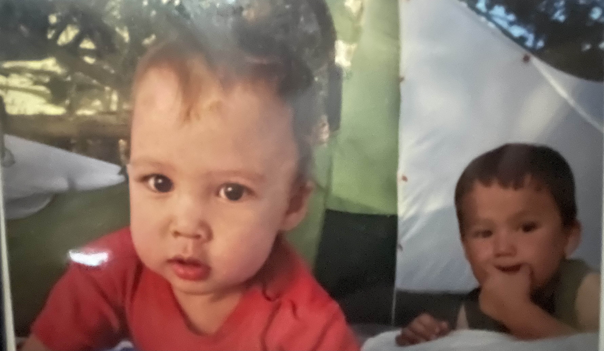
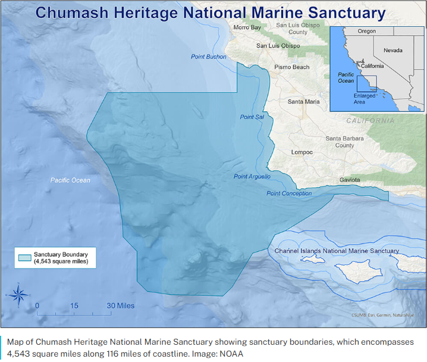

## Background 

 
I grew up in classy San Diego with my younger sister (2 years, 2 days) and my lovely parents. Like many children of that time I spent my days running around outside, reading Harry Potter, playing sports, and sprinting home after school to play Mario Kart. From the age of 6 I fell in love with soccer, signing my parents up for practices twice week and weekends devoted to driving endlessly for a 2 hour game. When I wasn't out on the field or buried deep in a book, my dad would take us out on hikes, stoking the early embers of my environmental passions that I carry today. 

My mother, then, is the source of my love of science. To me she has always been " a scientist", donning a lab coat and goggles before swirling chemicals in a flask. Even days spent playing in her office, couldn't sway that illusion. Now, of course, I can put a name to her job, which has in turn inspired my fixation with science writing. 

Those early years, all of us sat around the dinner table discussing whatever math problem or science concept either of my parents had introduced, are core memories at the foundation of who I am today.

## Beyond the classroom
 

My hobbies and interests have been much like a bee in a flower garden. Buzzing intermittently between flowers, landing briefly but never staying long. It is a garden, by my estimation, of odd pairings and a hodgepodge assortment. As a kid it was Pokemon and Harry Potter, until it became drawing and martial arts before switching to writing and ukulele. Now I've transitioned to Formula One and bird watching with the occasionally intrusion of cooking, tide pooling, and crocheting. 

That said, there are a few passions that have gripped my attention all the while. Soccer was an early one, sparking fond memories of Saturday mornings spent watching Bundesliga on the couch with my dad. <figure style="float: right; margin: 0 16px 8px 0; width: 35%;">

<figcaption>First camping trip with my sister (left)</figcaption>
</figure>Reading, of course is a constant, as is my love of camping. For many years our little caravan would make the short journey up into apple country (Julian, CA) to spend a weekend among the oaks and beneath the stars before coming home with an apple pie in our hands. 

## Career Goals
I have never been one to doggedly pursue a specific image of what I want my future to be. Rather, I have dove deep into the things that spark my interest, allowing their currents to take me onto the next. This method has been both a hindrance and a propellant of my career aspirations, at once obscuring the long term future but also enabling me to focus steadfastly on the things before me. As I have explored, discovered, and grown at UCSB that hazy future has begun to show glimpses of clarity. 

  In the near term I have my sights set on graduate school, hoping to obtain a PhD in environmental science or evolutionary biology. With that, of course, comes the understanding that a doctorate is not the end goal but another tool in the tool belt for meaningful impact. The work I hope to achieve will have a tangible, purposeful impact on our understanding and appreciation of the natural world. 
  
  For now, I am content with supporting the work of current PhD students as an intern, watching and learning from what I hope will be my future. My research interests range from the detailed world of environmental communication to the broader impacts of environmental policy and its relation to everyday lives. At Bren I have worked with PhD students Mukta Kelkar (now Dr. Kelkar!) and Cali Pfleger on their projects centered on the interface between environmental technologies and public perception. 
<figure style="float: right; margin: 0 16px 8px 0; width: 30%;">

<figcaption>Map of CHNMS boundary</figcaption>
</figure> Analysis of public comments from the Chumash National Marine Sanctuary (CHNMS) is set to be published at a later date, while another project analyzing news headlines on geoengineering technologies is still in progress. Both of them have been invaluable mentors, graciously pulling back the curtain on the research process and life as a graduate student. Any work I eventually produce will be deeply indebted on their generous guidance. 
   